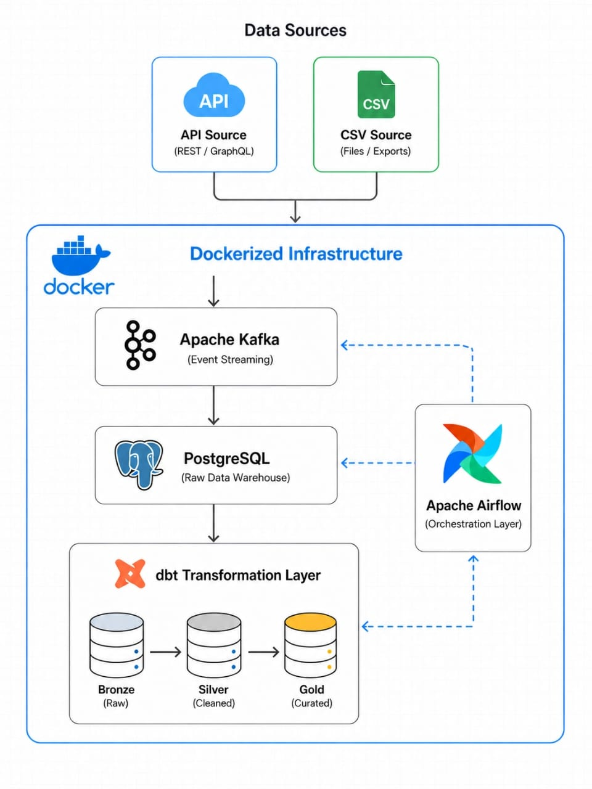

# 🌦️ Data Pipeline

## Project Description

An end-to-end real-time data engineering pipeline that ingests weather data from a public API, streams events using Apache Kafka, stores raw data in PostgreSQL, and transforms it using dbt following a Medallion Architecture approach.

The workflow is orchestrated using Apache Airflow and fully containerized with Docker Compose.

---

# 🛠️ Tech Stack

* **Apache Kafka** → Real-time streaming ingestion
* **Apache Airflow** → Workflow orchestration & scheduling
* **PostgreSQL** → Raw and transformed data storage
* **dbt** → Data transformation & testing
* **Docker Compose** → Containerized infrastructure

---

# 🏗️ Project Architecture

This architecture follows a Medallion pattern to ensure data quality, scalability, and clear separation between raw, cleaned, and aggregated data layers.

```text
Weather API
    ↓
Kafka Producer
    ↓
Kafka Topic (weather-events)
    ↓
Kafka Consumer
    ↓
PostgreSQL (Bronze Layer)
    ↓
dbt Transformations
    ├── Staging Layer
    ├── Silver Layer
    └── Gold Layer
    ↓
Analytics / Dashboards
```

---

# 📦 Kafka Infrastructure

* **Zookeeper** → Kafka cluster coordination
* **Kafka Broker** → Handles event streaming
* Topic: `weather-events`

---

# 🔄 Data Transformation with dbt

dbt is used to transform raw weather data using a Medallion Architecture approach.

## Medallion Layers

| Layer   | Description                            |
| ------- | ----------------------------------- |
| Bronze  | Raw ingested weather events         |
| Staging | Initial normalization               |
| Silver  | Cleaned and validated data          |
| Gold    | Aggregated analytics-ready datasets |

---

# 📄 Data Contract (Schema)

```json
{
  "source": "string",
  "temperature": "float | null",
  "humidity": "float | null",
  "ingestion_time": "datetime"
}
```

---

# 📊 Data Flow

* Weather API generates weather events
* Kafka streams real-time events
* Consumer service stores raw events in PostgreSQL
* dbt transforms raw data into analytics-ready models
* Airflow orchestrates dbt runs and testing
* Ensures idempotent ingestion and data quality checks at each stage

---

# ✅ Data Quality Testing

dbt tests are used to validate data integrity.

Implemented tests:

* temperature should not be null for CSV source
* humidity should not be null for CSV source
* ingestion_time must always be not null

---

# ▶️ Run dbt Manually

```bash
docker exec -it airflow_scheduler bash

cd /opt/airflow/weather_dbt

dbt run \
--project-dir /opt/airflow/weather_dbt \
--profiles-dir /opt/airflow/weather_dbt
```

---

# 🧪 Run dbt Tests

```bash
dbt test \
--project-dir /opt/airflow/weather_dbt \
--profiles-dir /opt/airflow/weather_dbt
```
---

# 📌 Airflow Orchestration

Apache Airflow is used to orchestrate dbt transformations and data quality tests using scheduled DAGs.

The DAG automates:

- dbt run
- dbt test
- Retry handling on failures


---

# 🚀 Features

* Real-time weather event streaming
* Automated dbt orchestration using Airflow
* Medallion Architecture implementation
* Containerized local environment
* Modular transformation layers
* Data quality validation using dbt tests

---

# 🧱 Project Structure

```text
├── airflow/
│   └── dags/
├── weather_dbt/
│   ├── models/
│   ├── tests/
│   └── dbt_project.yml
├── kafka/
├── docker-compose.yml
└── README.md
```

---

# ⚙️ System Design Considerations

* Decoupled ingestion using Kafka
* Retry mechanism using Airflow
* Modular transformations with dbt
* JSON-based raw ingestion flexibility
* Analytics-ready Gold layer design

---

# 🧠 Engineering Concepts Demonstrated

* Streaming ingestion pipelines
* Event-driven architecture
* Workflow orchestration
* Medallion Architecture
* Analytics engineering
* Data quality validation
* Containerized infrastructure
* Real-time data processing

---

# 📈 Sample Analytics Output

Example aggregated metrics generated in the Gold layer:

| date | avg_temperature | avg_humidity |
|------|-----------------|--------------|
| 2026-05-13 | 23.12 | 46.76 |

---

# ✅ Pipeline Validation

The pipeline was validated by querying PostgreSQL tables directly.

Example:

```
-- Validate data distribution by source
select source, count(*) 
from bronze.weather_raw
group by source;

-- Check final aggregated output
select * 
from gold.weather_metrics_final
limit 5;

```
